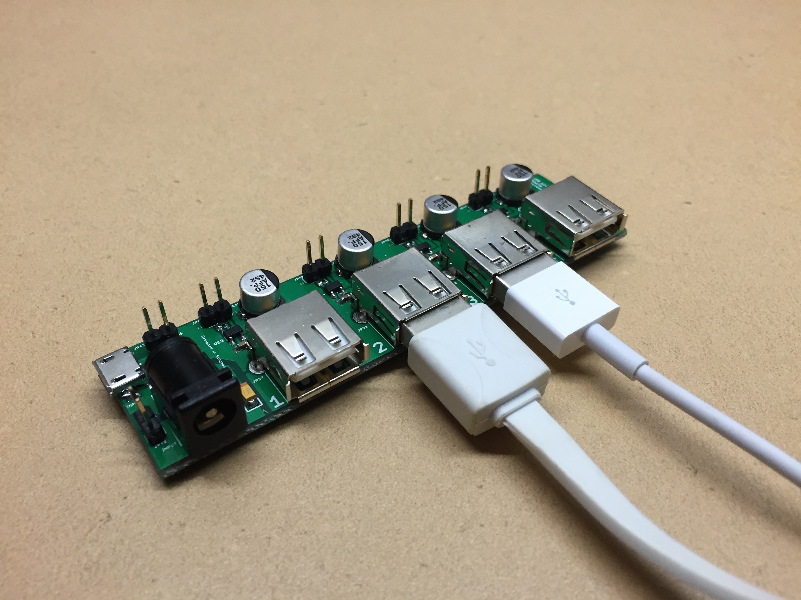

###4 Port USB hub
----------

####Introduction

With many low-cost linux board sitting around, getting more than 2 powered up becomes a pain since each of them require a 5V power supply! You can now power them all up and have external control over each port to turn them on/off.

This hardware allows you to connect a 5V, ___A power adapter and share it with up to 4 x USB port.

The Data (DM,DP) lines are not connected together but can be individually modified!  You can experiment with different resistor values and see if you can trigger a **samsung fast charge** or get your Iphone to recognize the charger!

**NOTE: ** You risk damaging your USB devices if the input polarity is reversed! One way to tell is to observe that the power led lights up, indicating the right polarity before inserting USB device. *You have been warned.*

###Power Connection

######Input
- 2.1mm diameter power jack
- microB USB
- jumper wire (+ and -)

The default power source is "selected" by the barrel jack connector with barrel jack supply as primary. microUSB will only be used if the barrel jack is unplugged.

######Output
- 4 x USB A port
- 1 x Jumper (+5v, GND)

###Signal Connection

######Input

You can individually control each USB port to turn them on/off using the **Enable** pin. Right now, the power switches chosen are **Active low** with a pull-down resistor.

######Output

Each USB power switch has a **FLAG** output that provides an open-drain output to notify users of a short/overcurrent.

You will need to add a pull-up resistor in you external circuit in order to use this.

######Casing

Oh yes, we now have a [3D-printable casing](casing) to house this useful little application and keeping the users safe from any accidental shorting!

###Lessons learnt

**V0.2 fabrication**
- Silkscreen text needs to be bigger and thicker
- Better DFM could be observed to aid future DIY repair work
- USB footprint for the through-hole is slightly too narrow. Should refer to exact datasheet measurement in future
- Visual inspection via a paper print-out before sending in order is a must. The panelized version has the connector numbering incrementing for each piece!
